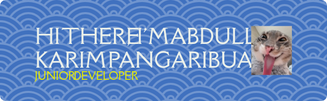

## HELLO EVERYONE IM ABDULLAH KARIM PANGAIRBUAN 👋

  

  <picture>
    <source media="(prefers-color-scheme: dark)" srcset="https://raw.githubusercontent.com/KarimPangaribuan/KarimPangaribuan/main/dist/github-snake-dark.svg" />
    <source media="(prefers-color-scheme: light)" srcset="https://raw.githubusercontent.com/KarimPangaribuan/KarimPangaribuan/main/dist/github-snake.svg" />
    
  </picture>

  
    
  

  

<!--
**KarimPangaribuan/KarimPangaribuan** is a ✨ _special_ ✨ repository because its `README.md` (this file) appears on your GitHub profile.

Here are some ideas to get you started:

- 🔭 I’m currently working on ...
- 🌱 I’m currently learning ...
- 👯 I’m looking to collaborate on ...
- 🤔 I’m looking for help with ...
- 💬 Ask me about ...
- 📫 How to reach me: ...
- 😄 Pronouns: ...
- ⚡ Fun fact: ...
-->

